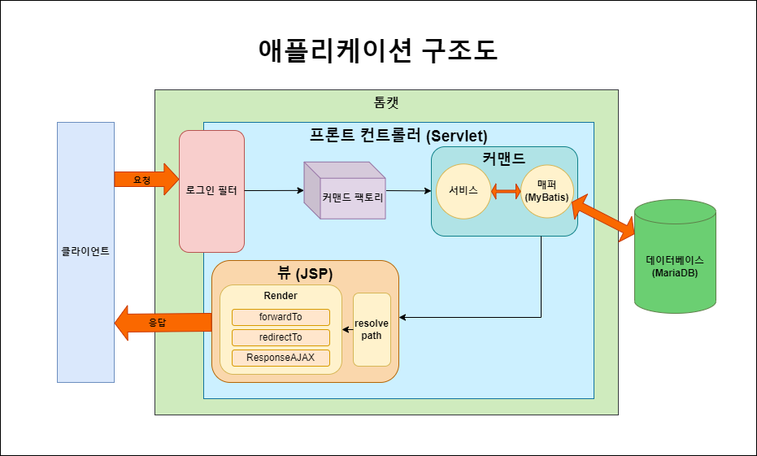
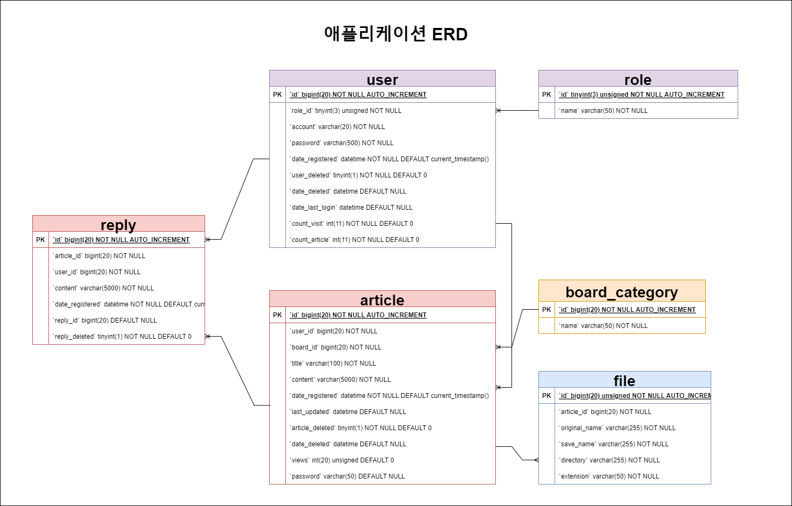

***
# 개요
### 대시보드와 회원 및 게시글 관리 기능이 있는 관리자 페이지 (종합 게시판웹)
### 개발 기간 : 3 주
### 개발 인원 : 1명
### 기술 
* 백엔드 : 


* 프론트 :


*   배포&nbsp;&nbsp;&nbsp;&nbsp; : 


### 프로젝트 진행 중점 목표
  * 공통 예외처리
  * 유지보수성 증대
    * 가독성
    * 가용성
  * 모듈화 (컴포넌트화)
    * 중복 코드 최소화
  * 회원 기능
    * 사용자 / 관리자 분리
  * 프론트 컨트롤러 / 커맨드 패턴 적용을 통한 스프링 프레임워크 모방
***
# 데모 링크
* <a>34.64.189.244:8080/admin</a>
  * 테스트 계정 :
    * ID : zxc
    * PW : zxc
***
# 목차
* [애플리케이션 구조](#애플리케이션-구조)
* [ERD](#ERD)
* [프로젝트 중점 목표 솔루션](#프로젝트-중점-목표-솔루션)
* [핵심 기능 목록](#핵심-기능-목록)
* [트러블슈팅](#트러블슈팅)
***
# 애플리케이션 구조

### 1. 로그인 필터
사용자의 요청이 먼저 거치게 되는 곳으로, 필터는 요청 경로를 분석하여 로그인 필요 여부를 판단합니다.</br>
경로가 'whiteList' 에 해당하거나, 이미 클라이언트가 이미 로그인된 경우 요청은 프론트 컨트롤러로 전달되고,
아닌 경우 바로 로그인 화면을 반환합니다.
<details>
<summary>코드 보기</summary>

```java
@WebFilter("/*")
public class LoginFilter implements Filter {

	/**
	 * 로그인 필터가 적용되지 않는 요청 경로 모음
	 */
	private static final String[] whiteList = {"/", "/login", "/login/", "/loginForm",
		"/loginForm/",
		"/register", "/register/", "/registerForm", "/registerForm/",
		"/admin/login/", "/admin/login", "/admin/loginForm", "/admin/loginForm/",
		".css", ".js", ".png", ".jpg", "/admin/users/idAvailabilityCheck"};

	/**
	 * whiteList 에 해당하는 요청 경로일 경우 pass 아닌 경우 로그인 여부 확인 후 로그인 되어있을 경우 진행, 아닐 경우 로그인 페이지 이동
	 */
	@Override
	public void doFilter(ServletRequest request, ServletResponse response, FilterChain chain)
		throws IOException, ServletException {

		HttpServletResponse httpServletResponse = (HttpServletResponse) response;
		HttpServletRequest httpServletRequest = (HttpServletRequest) request;
		String requestURI = httpServletRequest.getRequestURI();
		String queryStrings = httpServletRequest.getQueryString();
		HttpSession session = httpServletRequest.getSession();

		if (isWhiteListPath(requestURI, whiteList)) {
			chain.doFilter(request, response);
			return;
		}

		//어드민 요청일 경우
		if (CommandUtil.isAdminRequest(requestURI)) {
			if (CommandUtil.isUserLoggedIn(session, SessionKeys.LOGIN_ADMIN)) {
				chain.doFilter(request, response);
				return;
			}
			if (requestURI.equals(AdminCommands.INDEX.getPath())) {
				httpServletResponse.sendRedirect(AdminCommands.LOGIN_FORM.getPath());
				return;
			}
			if (queryStrings != null) {
				httpServletResponse.sendRedirect(
					AdminCommands.LOGIN_FORM.getPath() + "?redirectURL=" + requestURI + "?" + queryStrings);
				return;
			}
			httpServletResponse.sendRedirect(
				AdminCommands.LOGIN_FORM.getPath() + "?redirectURL=" + requestURI);
			return;
		}
	}
```

</details>

로그인 필터 외에 로그인 및 회원 등록시 비밀번호를 인코딩하여 전송하는 '비밀번호 필터'도 존재합니다.
<details>
<summary>코드 보기</summary>

```java
/**
 * 해당 경로 접속 시 PasswordEncryptionWrapper 로 Request 를 감싸 비밀번호 hash 처리
 */
@WebFilter({"/register", "/login", "/admin/login", "/admin/register"})
public class PasswordEncryptionFilter implements Filter {

	@Override
	public void doFilter(ServletRequest request, ServletResponse response, FilterChain chain)
		throws IOException, ServletException {

		PasswordEncryptionWrapper passwordEncryptionWrapper = new PasswordEncryptionWrapper((HttpServletRequest)request);
		chain.doFilter(passwordEncryptionWrapper, response);
	}

}
```
</details>

### 2. 프론트 컨트롤러
MVC 패턴의 컨트롤러에 해당하며, 
컨트롤러 중에서도 맨 앞에서 모든 요청을 받아 분배하는 역할을 하는 프론트 컨트롤러 입니다.</br>
필터를 거친 요청을 커맨드 팩토리에 넘겨 해당하는 커맨드(컨트롤러)를 동작시켜 필요한 정보를 반환하는 역할을 합니다.

<details>
<summary>코드 보기</summary>

```java
/**
 * 모든 요청이 시작되는 frontController
 *
 * 1. request 경로 정보를 이용하여 해당하는 Command 객체를 CommandFactory 에서 생성
 * 2. 잘못된 요청으로 인해 Command 가 null 일 경우 인덱스 페이지 반환
 * 3. Command 객체가 요청 정보를 이용하여 로직 실행 후 해당하는 View 객체 생성 반환
 * 4. View.resolverPath 를 통해 redirect 나 forward 에 맞는 경로 resolve,
 * 5. View.render 를 통해 해당 JSP (프론트) 클라이언트 반환
 */
@WebServlet("/")
public class Controller extends HttpServlet {

	/**
	 * 요청 경로에 해당하는 Command 객체를 실행하여 해당 페이지 반환
	 */
	protected void handleRequest(HttpServletRequest request, HttpServletResponse response)
		throws ServletException, IOException {

		request.setCharacterEncoding("UTF-8");

		String requestURI = getRequestURI(request);

		Command command = CommandFactory.getCommand(requestURI);

		if (isInValidRequestCommand(command)) {
			response.sendRedirect(AdminCommands.INDEX.getPath());
			return;
		}

		View view = command.execute(request, response);

		view.resolvePath(requestURI);

		view.render(request, response);
	}
}
```

</details>

### 3. 커맨드 팩토리
프론트 컨트롤러가 넘겨주는 요청에 맞추어 해당되는 커맨드를 반환해주는 역할을 합니다.</br>
요청을 분석하여 클라이언트/어드민 요청을 판단하고, 경로와 해당하는 커맨드를 정리해둔 커맨드 맵에서 커맨드를 가져옵니다.
<details>
<summary>코드 보기</summary>

```java
/**
 * 모든 Controller 에서 사용하는 Command 팩토리
 */
public abstract class CommandFactory {


	/**
	 * 어드민 페이지 커맨드 맵
	 */
	private static final Map<String, Command> adminCommandMap = AdminCommands.getMap();

	/**
	 * 클라이언트 페이지 커맨드 맵
	 */
	private static final Map<String, Command> clientCommandMap = ClientCommands.getMap();


	/**
	 * 요청 경로에 해당하는 Command 객체 반환
	 *
	 * @param requestURI 요청 경로
	 */
	public static Command getCommand(String requestURI) {

		if (CommandUtil.isAdminRequest(requestURI)) {
			return adminCommandMap.get(requestURI);
		}

		return clientCommandMap.get(requestURI);
	}
}
```
커맨드맵 예시

```java
/**
 * 클라이언트 Command 경로 및 CommandMap 을 관리하는 객체
 */
@Getter
@AllArgsConstructor
public enum ClientCommands {

	/**
	 * 메인 페이지
	 */
	INDEX("/"),

	/**
	 * 로그인
	 */
	LOGIN("/login"),

	/**
	 * 로그인 화면
	 */
	LOGIN_FORM("/loginForm"),

	/**
	 * 회원가입
	 */
	REGISTER("/register"),

	/**
	 * 회원가입 화면
	 */
	REGISTER_FORM("/registerForm"),

	/*
	편의를 위한 enum 끝 표시 //TODO THE_END_OF_ENUM 삭제
	 */
	THE_END_OF_ENUM(null);
	String path;

	/**
	 * 클라이언트 CommandMap
	 */
	@Getter
	private static final Map<String, Command> map = new HashMap<>();

	static {
		map.put(ClientCommands.INDEX.path, new IndexCommand());
		map.put(ClientCommands.LOGIN_FORM.path, new LoginFormCommand());
		map.put(ClientCommands.LOGIN.path, new LoginCommand());
		map.put(ClientCommands.REGISTER_FORM.path, new RegisterFormCommand());
		map.put(ClientCommands.REGISTER.path, new RegisterCommand());
	}
}
```

</details>


### 4. 커맨드
세분화된 컨트롤러의 역할을 합니다. </br>
서비스 객체를 통해 필요한 로직을 수행하며, 
서비스 객체는 매퍼 객체를 통해 DB와 연결하여 데이터를 주고 받습니다.</br>
forward 를 할 지, redirect 를 할 지, Json 을 반활할지에 따라 그에 맞는 View 객체를 반환합니다. </br>

<details>
<summary>코드 보기</summary>

게시글 상세 페이지 예시 :
```java
/**
 * 게시글 상세 보기 관련 커맨드
 *
 * 1. 게시글 정보 가져오고 조회수 증가
 * 2. 해당 게시글 등록된 파일(이미지)이 있을 경우 파일 정보 (Base64 인코딩 이미지) 등록 후 반환
 */
public class DetailCommand implements
	Command {

	@Override
	public View execute(HttpServletRequest request, HttpServletResponse response)
		throws ServletException, IOException {

		ArticleService articleService = new ArticleService();

		String id = request.getParameter("articleId");
		Long boardId = CommandUtil.getBoardIdByRequest(request);

		if (!articleService.isValidArticleId(id, boardId)) {
			return View.forwardTo(AdminCommands.ERROR_HANDLER.getPath(),
				Errors.VALIDATION_ERROR.getMessage());
		}

		Long articleId = Long.valueOf(id);

		articleService.increaseArticleViewsById(articleId);
		Article article = articleService.getArticleById(articleId);

		FileService fileService = new FileService();

		File file = fileService.getFileByArticleId(articleId);
		if (!Objects.equals(file,null)){
			article.setImage(fileService.getEncodedImageFromFile(file));
		}

		request.setAttribute("article", article);
		return View.forwardTo(AdminCommands.ARTICLE_DETAIL.getPath());
	}
}
```

</details>

### 5. 뷰
요청에 알맞는 프론트를 넘기는 역할을 담당합니다.</br>
resolvePath 를 통해 경로를 성정하며, render 를 통해 최종적으로 프론트를 호출하여 반환합니다.</br>
render 에서 forward, sendRedirect, AJAX 에 맞는 반환을 합니다.

<details>
<summary>코드 보기</summary>

resolvePath:

```java
/**
 * redirect 가 false (forward)인 경우에만 어드민 클라이언트 구분하여 경로명 변경
 *
 * @param requestURI 요청 경로
 */
public void resolvePath(String requestURI) {
    if (isAJAX){
        return;
    }
    //어드민 경로인 경우
    if (CommandUtil.isAdminRequest(requestURI)) {
        if (isRedirect) {
            return;
        }
        if (path.equals("/admin")) {
            path = "/WEB-INF/views/admin/index.jsp";
            return;
        }
        path = "/WEB-INF/views" + path + ".jsp";
        return;
    }
}
```
render:

```java
/**
 * 앞단으로 정보 전달 및 화면 요청
 * AJAX 일 경우 커맨드에서 대입된 JsonObject 반환
 * redirect 는 바로,
 * forward 는 에러 메세지 있을 경우 setAttribute 하여 프론트 전달
 *
 * @param request  요청 객체
 * @param response 응답 객체
 */
public void render(HttpServletRequest request, HttpServletResponse response)
    throws IOException, ServletException {
    if (isAJAX) {
        response.setContentType("application/json");
        response.getWriter().print(jsonObject);
        return;
    }
    response.setContentType("text/html;charset=UTF-8");
    if (isRedirect) {
        response.sendRedirect(path);
        return;
    }
    if (errorMessage != null) {
        request.setAttribute("error", errorMessage);
    }
    request.getRequestDispatcher(path).forward(request, response);
}
```
</details>

***

# ERD

- 게시판별로 테이블을 따로 두지 않고 한 개의 통합 article 테이블과 board_category 테이블을 둠으로써 가용성을 높였습니다.
***
# 프로젝트 중점 목표 솔루션

### 공통 에러 처리 모듈
### 모듈화 (컴포넌트화)
### 가독성
### 가용성

***
# 핵심 기능 목록
```
1. 회원 기능
  - 로그인 (서블릿 필터를 통한 검증 / 세션을 이용한 로그인 정보 저장)
  - 회원가입 (AJAX 요청을 통한 ID 중복 검사)
  - 비밀번호 인코딩 (서블릿 필터를 통해 요청 비밀번호 암호화하여 저장)
  - 회원 정보 (회원 기본 정보 및 회원이 작성한 글 목록 보기)
  - 마지막 접속일 및 방문 횟수 기록 (로그인 기준)
2. 게시판 기능
  - 검색 (공통 검색 컴포넌트)
  - 페이징 (공통 페이징 컴포넌트)
  - 공지사항 (조회 전용 게시판) 
  - 자유게시판 (댓글 및 대댓글 기능이 있는 게시판)
  - 1:1 문의 (사용자 문의 답글 기능이 있는 게시판)
  - 갤러리 (3가지 뷰 모드가 있는 이미지 게시판)
3. 대시보드
  - 게시글 등록 현황 그래프 (ChartJs)
  - 총계 (총 유저수, 게시글 수 및 미답변 1:1 문의 수)
  - 게시글 목록 (게시판별 최근 게시글 각 3개 / 조회수 상위 5개 게시글 목록)
4. 공통
  - redirectURL (인덱스가 아닌 다른 경로로 접속 시도시, 로그인 후 접속 시도한 페이지로 이동)
  - 클라이언트/서버 유효성 검증 (서버 유효성 검증 실패시 알러트 표시후 인덱스 이동)

```

***
